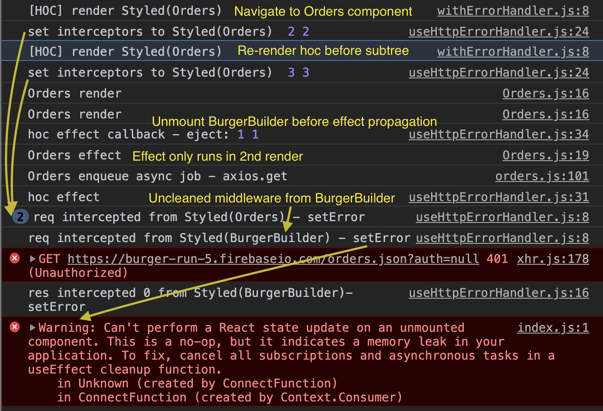
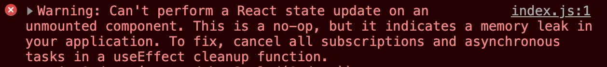

# useEffect - guarding and canceling async tasks

## Understanding React Component Life Cycle

To understand useEffect, you must first understand the React component life cycle.  
As our app starts at the BurgerBuilder page, it follows the steps below:


1. The wrapping higher order component, `withErrorHandler` is rendered. `useHttpErrorHandler` custom hook sets axios interceptors for outgoing request and incoming request in render block. (not inside useEffect).

- Note that setting interceptors and other listeners are creating side effect indeed.
- But we're not doing that in the useEffect hook because we wanted to set it up before the effects in the sub components runs.
- If we set the interceptors inside withErrorHandler effect, they won't be able to intercept any req/res generated during the sub-component mount.

2. After hoc is rendered, BurgerBuilder renders.

- Render happens top-down. useEffect/onMount runs bottom-up.

3. After all the sub components are rendered to the DOM(by React) and painted to the screen(by browser), useEffect which was used to be `componentDidMount` method executes bubbling up from the bottom of the tree.

- updates `isLoading` state for spinner. This will trigger render of BurgerBuilder component.
- calls `initIngredient` thunk action dispatcher which runs `axios.get` which returns pending promise.
  - XHR send() is queued into task queue (like setTimeout) which runs after all the micro tasks in job queue are executed AND while the main stack frame is empty.
  - But axios returns Promise (so does fetch)
  - Promise is a micro task which runs after the main call stack is empty and before setTimeout gets called.

4. After BurgerBuilder effect runs, the effect from its parent runs.

- usually `useEffect` callback runs before the effect, but because the component has mounted (meaning there is no previous render to draw useEffect callback from), it went straight to the effect.
- The first render cycle (mounting) ends here, and now update (if any)

5. Because of isLoading state update in step 3, BurgerBuilder component is re-rendered, including all of its sub components.

- Note that we don't run useEffect in BurgerBuilder component this time because we provided dependency list with only `ingredients` prop. Effect and effect callback will not run if the given dependency doesn't change.
- useEffect and its callback will still run on `unmount`.

6. When rendering is done and main stack frame is empty, axios request fires.

- The request interceptor we set in step1 will run before the request is send away. It sets `error` state to null to reset it before we make a new request.
- We didn't set the interceptor for non-error response, but response comes back in almost instantly.

7. After the Promise resolves, we set `isLoading` state to false to take down the spinner after `await`.

- setIsLoading is run in async function. It would be same as placing it in `.then`, so that it runs once the Promise resolves with response.

8. State update from step 7 triggers re-render of BurgerBuilder. Now we're done until the next event.

### Event: Navigate to Orders page


1. HOC wrapping Orders gets rendered. Sets another pair of interceptors

- Note that we haven't cleared the previously set interceptors yet. If we attached the interceptors inside `useEffect` it will be always cleared before adding a new one. Because we are setting interceptors outside `useEffect` it gets cleared only when the deps change or on unmount.

2. Now Orders components gets rendered, then all of its sub-components.
3. Between render and onMount, BurgerBuilder wrapped in hoc gets unmounted, and right before unmount, `useEffect` callback in hoc gets called to eject interceptors.

- on Unmount, `useEffect` DOES NOT run after its callback. We're done after the cleanup.

4. Back to the beginning of `onMount useEffect` bubbling up from the bottom.

- Orders `useEffect` runs.
- axios.get is called inside effect.
- this is first-time render for Orders(mount), so useEffect callback was skipped.

5. The parent(HOC) effect runs (nothing is there). **The mount cycle ends here.**
6. Stack is empty. Now enqueued axios job is called

- req interceptor gets called before sending out request.
- **sets error state** in hoc.

7. 401 response received. browser logs xhr error.
8. Response interceptor intercepts the response. **sets error state.**
9. Now re-render hoc. sets yet another pair of interceptors.
10. Keeps rendering down to Orders component.
11. After rending down to the bottom, promise rejection kicks in before useEffect bubble.

- Orders' `isLoading` is set to false after `await`

12. Orders' useEffect has deps on `fetchOrders` and `idToken`, none of which have changed.

- HOC's useEffect has interceptors as deps, which are changed in step 9.
- So skip to the HOC useEffect callback and eject interceptors.
- then run useEffect. (nothing is there)

13. Now re-render Orders because it has new state from step 11.

### Key Takeaways

- If you set up your listeners (interceptors, or any other callback functions) in render block instead of `useEffect`, you should have a good reason to do so.
  - Multiple instances of the same axios middleware function can be added to the interceptors because you are not always ejecting the old one in the `useEffect callback` before you add a new one.
  - If those middlewares return Promise, multiple middlewares in the middleware stack will be called one after the other before request / response.
  - This means that the same middleware gets called again and again on one event.
- Anything that you do inside render block that is not related to the returned React Element, is a side effect (or just _effect_). They make changes to the things outside the component and make it hard to track down the bug. (This thing changes A in foo which changes B and C in baz,...)
  - That is why React recommends you to contain side effects within `useEffect`.
- If you need to do something with the state/props other than returning ReactElement to the virtual DOM, put them in the `useEffect`.
- If your effect sets up a listener (subscription) to some external data source (DOM event, HTTP req/res, setTimeout...), you need to clean it up in `useEffect callback`
- React will alway run `useEffect callback` returned from the previous `useEffect` before running the current `useEffect`. This ensures new listeners are added after the old ones are cleaned up.

### Why do I get `state update on an unmounted component` warning?

This happens when you set up interceptors in render block and are using `<React.StrictMode>`.

- React strict mode renders everything twice except for your `useEffect` (if useEffect is not called, neither does its callback).
- Your interceptors will be added twice but your useEffect runs just once. This means that you're cleaning up only one of two middlewares you added. Uncleaned interceptors remain in the middleware stack.
- In other words, you are stacking up the same middlewares per render. (technically 2 renders because of strict mode).
- Those remaining middlewares get called even after you navigate to different component that uses the same axios instance.
- But I think

_React strict mode + effects in render_


## So what is the correct place to mount this interceptor?

Add interceptors right after creating the axios instance. (It will be only loaded once.)

- [Where is the correct place to put interceptors in React app?](https://github.com/axios/axios/issues/2315#issuecomment-568679445)

## Cleaning Up async requests in useEffect



You can cancel pending axios request from unmounted component by using the axios _cancel token_ API.

```js
import Axios from 'axios'; // import axios constructor
import axios from '../../common/axios-orders'; // import axios instance
.
.
.
useEffect(() => {
    // CancelToken is the static method!
    const source = Axios.CancelToken.source();
    axios // pass an option as 2nd arg
      .get('/orders.json', { cancelToken: source.token })
      // this will run even if request is canceled!!!
      .then((res) => {
        if (res.data) {
          const orders = Object.entries(res.data).map(([id, order]) => ({
            id,
            ...order,
          }));
          setOrders(orders);
        }
        setIsLoading(false);
      })
      .catch((err) => {
        if (Axios.isCancel(err)) {
          console.log('fetchOrders canceled');
        } else {
          setIsLoading(false);
          console.error(err);
        }
      });
    return () => {
      // cancel request that has the source.token
      source.cancel();
    };
  }, []);
```

With redux thunk action dispatcher + async await
`features/orders/Orders`

```js
useEffect(() => {
  const source = Axios.CancelToken.source(); // get req source
  (async () => {
    const thrown = await fetchOrders(source); // call thunked dispatcher with source
    // stop if request canceled
    if (!Axios.isCancel(thrown)) {
      setIsLoading(false); // spinner off when done
    }
  })();

  return () => {
    source.cancel(); // cleanup: cancel req with specified token on unmount
  };
}, [fetchOrders]);
```

`store/ducks/orders`

```js
/**
 *
 * @param {Source} source request source from axios.CancelToken.token()
 */
export const fetchOrders = (source) => async (dispatch) => {
  try {
    const response = await axios.get('/orders.json', {
      cancelToken: source.token,
    });
    dispatch(fetchSuccess(response.data));
  } catch (err) {
    if (Axios.isCancel(err)) {
      console.log('fetchOrders canceled by effect cleanup in Orders');
      return err;
    } else {
      console.error(err);
      dispatch(fetchFail(err));
    }
  }
};
```

Readings:

- [Read Hook - Clean Up useEffect](https://dev.to/iquirino/react-hook-clean-up-useeffect-24e7)

- [Clean up async requests in useEffect hooks](https://dev.to/pallymore/clean-up-async-requests-in-useeffect-hooks-90h)

## React Async package

> _To avoid calling setState after unmount from a hook, you can use the useEffect callback to set a ref value on unmount\*, and use that as a guard in your promise callbacks to check whether the component is still mounted before updating state. ... But to be honest you're probably better off not reinventing this wheel and use **useAsync** directly, because it's fully tested and covers other edge cases as well._  
> _[ghengeveld](https://github.com/facebook/react/issues/15006#issuecomment-470285648)_

- \* Use `let` flag instead as Dav Abramov suggests

- [react-async](https://github.com/async-library/react-async)
- [The Power and Convenience of useAsync](https://medium.com/better-programming/the-power-and-convenience-of-useasync-e4a3e4934143)

## Guarding against unmount

Github issues:

- [setState hook inside useEffect can cause unavoidable warning Can't perform a React state update](https://github.com/facebook/react/issues/14369#issuecomment-468267798)
- [useEffect memory leak when setting state in fetch promise](https://github.com/facebook/react/issues/15006)
  When you try to update a state from an unmounted component, React will throw this error:

Articles:

- [Cancelling a Promise with React.useEffect](https://juliangaramendy.dev/use-promise-subscription/)

```jsx
function BananaComponent() {
  const [bananas, setBananas] = React.useState([]);

  React.useEffect(() => {
    let isSubscribed = true;
    fetchBananas().then((bananas) => {
      // checks flag at the time of Promise resolution
      if (isSubscribed) {
        setBananas(bananas);
      }
    });
    return () => (isSubscribed = false);
  }, []);

  return (
    <ul>
      {bananas.map((banana) => (
        <li>{banana}</li>
      ))}
    </ul>
  );
}
```

Handling pending and rejected promise

```js
function BananaComponent() {

  const [bananas, setBananas] = React.useState(undefined);
  const [error, setError] = React.useState('');

  React.useEffect(() => {
    let isSubscribed = true;
    fetchBananas()
      .then(bananas => (isSubscribed ? setBananas(bananas) : null))
      .catch(error => (isSubscribed ? setError(error.toString()) : null));

    return () => (isSubscribed = false);
  }, []);

  render (
    <ul>
    {!error && !bananas && <li className="loading">loading...</li>)}
    {!error && bananas && bananas.map(banana => <li>{banana}</li>)}
    {error && <li className="error">{error}</li>}
    </ul>
  )
}
```

Custom hook version

```jsx
export function usePromise(promiseOrFunction, defaultValue) {
  const [state, setState] = React.useState({
    value: defaultValue,
    error: null,
    isPending: true,
  });

  React.useEffect(() => {
    const promise =
      typeof promiseOrFunction === 'function'
        ? promiseOrFunction()
        : promiseOrFunction;

    let isSubscribed = true;
    promise
      .then((value) =>
        isSubscribed ? setState({ value, error: null, isPending: false }) : null
      )
      .catch((error) =>
        isSubscribed
          ? setState({ value: defaultValue, error: error, isPending: false })
          : null
      );

    return () => (isSubscribed = false);
  }, [promiseOrFunction, defaultValue]);

  const { value, error, isPending } = state;
  return [value, error, isPending];
}
```

Usage

```jsx
function BananaComponent() {

  const [bananas, error, pending] = usePromise(fetchBananas, [], [])

  render (
    <ul>
    {pending && <li className="loading">loading...</li>)}
    {!pending && !error && bananas.map(banana => <li>{banana}</li>)}
    {error && <li className="error">{error}</li>}
    </ul>
  )
}
```

**But in practice, use [useAsync](https://docs.react-async.com/guide/async-components#more-flexibility-with-useasync)**

- [ABORT DATA FETCHING IN EFFECT HOOK](https://www.robinwieruch.de/react-hooks-fetch-data) (towards the end)

```js
const useDataApi = (initialUrl, initialData) => {
  const [url, setUrl] = useState(initialUrl);
  const [state, dispatch] = useReducer(dataFetchReducer, {
    isLoading: false,
    isError: false,
    data: initialData,
  });
  useEffect(() => {
    let didCancel = false;
    const fetchData = async () => {
      dispatch({ type: 'FETCH_INIT' });
      try {
        const result = await axios(url);
        // if Promise gets resolved after 'unmount' (or when url updates)
        // action is not dispatched.
        if (!didCancel) {
          dispatch({ type: 'FETCH_SUCCESS', payload: result.data });
        }
      } catch (error) {
        if (!didCancel) {
          dispatch({ type: 'FETCH_FAILURE' });
        }
      }
    };
    fetchData();
    return () => {
      // this runs between next render and next useEffect
      didCancel = true;
    };
  }, [url]);
  return [state, setUrl];
};
```

[gaearon](https://github.com/facebook/react/issues/14369#issuecomment-468267798)

```js
React.useEffect(() => {
  let didCancel = false;

  // ...
  // you can check didCancel
  // before running any setState
  // ...

  return () => {
    didCancel = true;
  };
});
```

> The solution in #14369 (comment) is usually the right one. (Or **preferably you'd cancel the async work you're doing.**)
