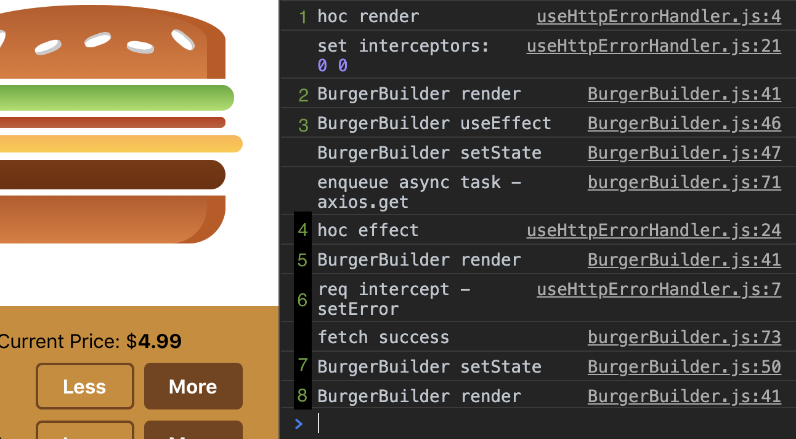
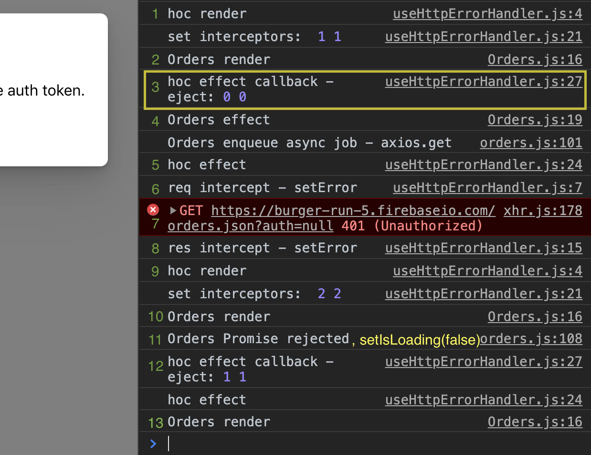

# useEffect - guarding and canceling async tasks

## Understanding React Component Life Cycle

To understand useEffect, you must first understand the React component life cycle.  
As our app starts at the BurgerBuilder page, it follows the steps below:


1. The wrapping higher order component, `withErrorHandler` is rendered. `useHttpErrorHandler` custom hook sets axios interceptors for outgoing request and incoming request in render block. (not inside useEffect).

- Note that setting interceptors and other listeners are creating side effect indeed.
- But we're not doing that in the useEffect hook because we wanted to set it up before the effects in the sub components runs.
- If we set the interceptors inside withErrorHandler effect, they won't be able to intercept any req/res generated during the sub-component mount.

2. After hoc is rendered, BurgerBuilder renders.

- Render happens top-down. useEffect/onMount runs bottom-up.

3. After all the sub components are rendered to the DOM(by React) and painted to the screen(by browser), useEffect which was used to be `componentDidMount` method executes bubbling up from the bottom of the tree.

- updates `isLoading` state for spinner. This will trigger render of BurgerBuilder component.
- calls `initIngredient` thunk action dispatcher which runs `axios.get` which returns pending promise.
  - XHR send() is queued into task queue (like setTimeout) which runs after all the micro tasks in job queue are executed AND while the main stack frame is empty.
  - But axios returns Promise (so does fetch)
  - Promise is a micro task which runs after the main call stack is empty and before setTimeout gets called.

4. After BurgerBuilder effect runs, the effect from its parent runs.

- usually `useEffect` callback runs before the effect, but because the component has mounted (meaning there is no previous render to draw useEffect callback from), it went straight to the effect.
- The first render cycle (mounting) ends here, and now update (if any)

5. Because of isLoading state update in step 3, BurgerBuilder component is re-rendered, including all of its sub components.

- Note that we don't run useEffect in BurgerBuilder component this time because we provided dependency list with only `ingredients` prop. Effect and effect callback will not run if the given dependency doesn't change.
- useEffect and its callback will still run on `unmount`.

6. When rendering is done and main stack frame is empty, axios request fires.

- The request interceptor we set in step1 will run before the request is send away. It sets `error` state to null to reset it before we make a new request.
- We didn't set the interceptor for non-error response, but response comes back in almost instantly.

7. After the Promise resolves, we set `isLoading` state to false to take down the spinner after `await`.

- setIsLoading is run in async function. It would be same as placing it in `.then`, so that it runs once the Promise resolves with response.

8. State update from step 7 triggers re-render of BurgerBuilder. Now we're done until the next event.

### Event: Navigate to Orders page



1. HOC wrapping Orders gets rendered. Sets another pair of interceptors

- Note that we haven't cleared the previously set interceptors yet. If we attached the interceptors inside `useEffect` it will be always cleared before adding a new one. Because we are setting interceptors outside `useEffect` it gets cleared only when the deps change or on unmount.

2. Now Orders components gets rendered, then all of its sub-components.
3. Between render and onMount, BurgerBuilder wrapped in hoc gets unmounted, and right before unmount, `useEffect` callback in hoc gets called to eject interceptors.

- on Unmount, `useEffect` DOES NOT run after its callback. We're done after the cleanup.

4. Back to the beginning of `onMount useEffect` bubbling up from the bottom.

- Orders `useEffect` runs.
- axios.get is called inside effect.
- this is first-time render for Orders(mount), so useEffect callback was skipped.

5. The parent(HOC) effect runs (nothing is there). **The mount cycle ends here.**
6. Stack is empty. Now enqueued axios job is called

- req interceptor gets called before sending out request.
- **sets error state** in hoc.

7. 401 response received. browser logs xhr error.
8. Response interceptor intercepts the response. **sets error state.**
9. Now re-render hoc. sets yet another pair of interceptors.
10. Keeps rendering down to Orders component.
11. After rending down to the bottom, promise rejection kicks in before useEffect bubble.

- Orders' `isLoading` is set to false after `await`

12. Orders' useEffect has deps on `fetchOrders` and `idToken`, none of which have changed.

- HOC's useEffect has interceptors as deps, which are changed in step 9.
- So skip to the HOC useEffect callback and eject interceptors.
- then run useEffect. (nothing is there)

13. Now re-render Orders because it has new state from step 11.

## Cleaning Up async requests in useEffect


You can cancel pending axios request from unmounted component by using the axios _cancel token_ API.

```js
import Axios from 'axios'; // import axios constructor
import axios from '../../common/axios-orders'; // import axios instance
.
.
.
useEffect(() => {
    // CancelToken is the static method!
    const source = Axios.CancelToken.source();
    axios // pass an option as 2nd arg
      .get('/orders.json', { cancelToken: source.token })
      // this will run even if request is canceled!!!
      .then((res) => {
        if (res.data) {
          const orders = Object.entries(res.data).map(([id, order]) => ({
            id,
            ...order,
          }));
          setOrders(orders);
        }
        setIsLoading(false);
      })
      .catch((err) => {
        if (Axios.isCancel(err)) {
          console.log('fetchOrders canceled');
        } else {
          setIsLoading(false);
          console.error(err);
        }
      });
    return () => {
      // cancel request that has the source.token
      source.cancel();
    };
  }, []);
```

With redux thunk action dispatcher + async await
`features/orders/Orders`

```js
useEffect(() => {
  const source = Axios.CancelToken.source(); // get req source
  (async () => {
    const thrown = await fetchOrders(source); // call thunked dispatcher with source
    // stop if request canceled
    if (!Axios.isCancel(thrown)) {
      setIsLoading(false); // spinner off when done
    }
  })();

  return () => {
    source.cancel(); // cleanup: cancel req with specified token on unmount
  };
}, [fetchOrders]);
```

`store/ducks/orders`

```js
/**
 *
 * @param {Source} source request source from axios.CancelToken.token()
 */
export const fetchOrders = (source) => async (dispatch) => {
  try {
    const response = await axios.get('/orders.json', {
      cancelToken: source.token,
    });
    dispatch(fetchSuccess(response.data));
  } catch (err) {
    if (Axios.isCancel(err)) {
      console.log('fetchOrders canceled by effect cleanup in Orders');
      return err;
    } else {
      console.error(err);
      dispatch(fetchFail(err));
    }
  }
};
```

Readings:

- [Read Hook - Clean Up useEffect](https://dev.to/iquirino/react-hook-clean-up-useeffect-24e7)

- [Clean up async requests in useEffect hooks](https://dev.to/pallymore/clean-up-async-requests-in-useeffect-hooks-90h)

## React Async package

- [repo](https://github.com/async-library/react-async)
- [useEffect memory leak when setting state in fetch promise](https://github.com/facebook/react/issues/15006)

## Problem with setting listeners in render

Setting listeners that calls setState in render can cause some unexpected pain even if you clean them up in `useEffect` callback.

```js
import { useState, useEffect } from 'react';

export default (axios) => {
  console.log('useError render');
  const [error, setError] = useState(null);
  let errMsg;
  const reqInterceptor = axios.interceptors.request.use((req) => {
    console.log('req intercept - setError');
    setError(null);
    return req;
  });

  const resInterceptor = axios.interceptors.response.use(
    (res) => res,
    (err) => {
      // request was made and server responded with a non-200 status
      if (err.response) {
        console.log('Out of 200');
        errMsg = [
          JSON.stringify(err.response.status),
          JSON.stringify(err.response.data),
        ];
      } else if (err.request) {
        // request was made, but no response was received
        console.log('no response');
        console.log(err.request);
        errMsg = 'Network Error: No response';
      } else {
        // error while setting up the request
        console.log('non-network error');
        errMsg = err.message;
      }
      console.log('res intercept - setError');
      setError(errMsg);
      // async middleware returns Promise! (so that next middleware can chain the result)
      return Promise.reject(err);
    }
  );
  console.log('set interceptors: ', reqInterceptor, resInterceptor);

  useEffect(() => {
    console.log('update effect');
    // cleanup when the component using this custom hook unmounts
    return () => {
      console.log('eject:', reqInterceptor, resInterceptor);
      axios.interceptors.request.eject(reqInterceptor);
      axios.interceptors.response.eject(resInterceptor);
    };
  }, [
    // linter enforced list
    reqInterceptor,
    resInterceptor,
    axios.interceptors.request,
    axios.interceptors.response,
    errMsg,
  ]);
  useEffect(() => {
    console.log('will unmount effect');
    return () => {
      console.log('will unmount cleanup');
    };
  }, []);

  const closeErrorModal = () => {
    setError(null);
  };
  return [error, closeErrorModal];
};
```

The above code logs this to the console as I navigate from BurgerBuilder page to Orders page:  
(\* make sure that you don't have components nested inside <React.Strict> since it renders function components twice except for the useEffect callback. )


1. withErrorHandler hoc wrapping BurgerBuilder is rendered. It sets axios interceptors and renders its subtree (BurgerBuilder).
2. After subtree is rendered & painted,
   useEffect callback is skipped because it is just mounted and doesn't have previous render's callback. Now useEffect runs in the order they are defined.
3.

## Guarding against unmount

Github issues:

- [setState hook inside useEffect can cause unavoidable warning Can't perform a React state update](https://github.com/facebook/react/issues/14369#issuecomment-468267798)
- [useEffect memory leak when setting state in fetch promise](https://github.com/facebook/react/issues/15006)
  When you try to update a state from an unmounted component, React will throw this error:

Articles:

- [Cancelling a Promise with React.useEffect](https://juliangaramendy.dev/use-promise-subscription/)
- [ABORT DATA FETCHING IN EFFECT HOOK](https://www.robinwieruch.de/react-hooks-fetch-data) (towards the end)
